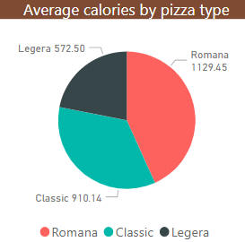
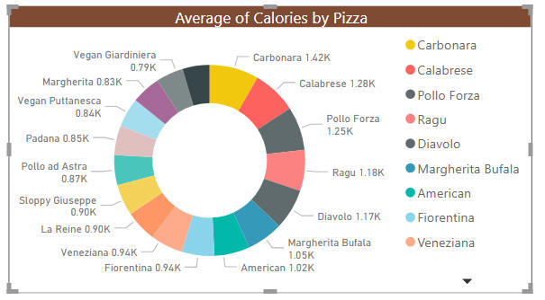

1. Установите на свой компьютер Power Bi Desktop
2. Загрузите файл (Calories.xlsx)[https://github.com/ximik666/practice_ecomomic/raw/main/4.%D0%90%D0%BD%D0%B0%D0%BB%D0%BE%D0%B3%D0%B8%20BI-%D1%81%D0%B8%D1%81%D1%82%D0%B5%D0%BC/Calories.xlsx] в Power Bi Desktop
3. Вы должны увидеть, что он содержит разбивку количества калорий для различных типов пиццы Пицца Экспресс
4. Создайте диаграмму по типам пицц, чтобы сравнить средние калорийности трех разных типов пиццы.

5. Добавьте диаграмму пончиков, чтобы показать распределение калорий в пицце

6. Выведите название самой калоройной и самой диетической пиццы прямо в отчете. 
7. Сохраните отчет в файл с вашей фамилией и пришлите на zainullin@ieml.ru до 26 декабря. После этого вся информация будет передана Крамину Тимуру Владимировичу.
